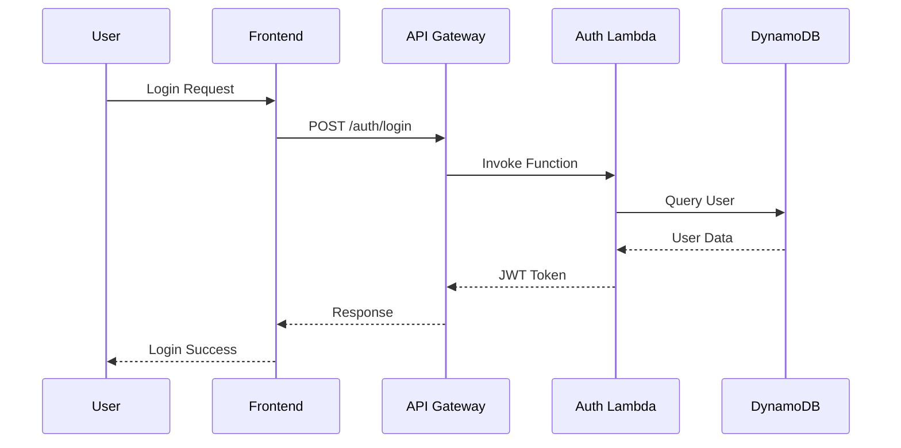
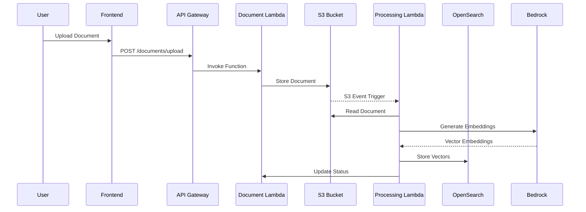
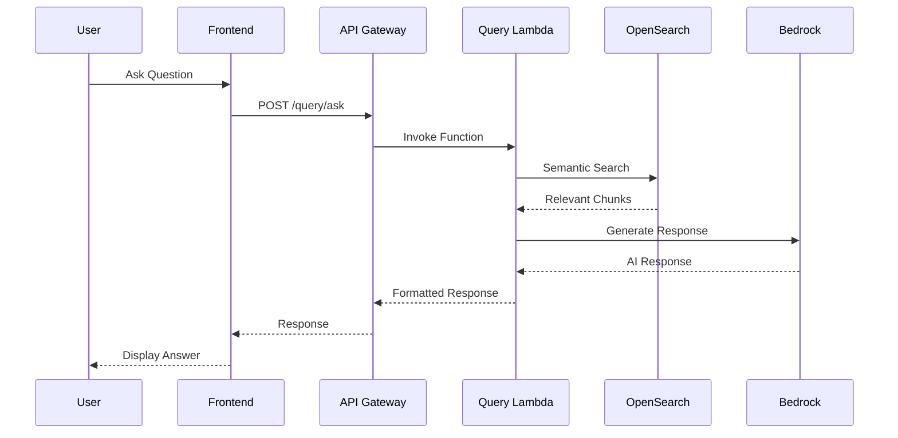

# AWS Services Integration Design

## Service Selection Rationale

### Core AWS Services

#### 1. Amazon Bedrock
**Purpose**: AI-powered question answering and text processing
**Model Selection**: Claude 3 Haiku
**Rationale**: 
- Cost-effective for high-volume text processing
- Fast response times (< 3 seconds)
- Strong reasoning capabilities for Q&A
- Built-in safety features

**Integration Pattern**:
```javascript
// Bedrock Integration Example
const bedrockClient = new BedrockRuntimeClient({
  region: 'us-east-1',
  credentials: fromNodeProviderChain()
});

const invokeModel = async (prompt, context) => {
  const command = new InvokeModelCommand({
    modelId: 'anthropic.claude-3-haiku-20240307-v1:0',
    contentType: 'application/json',
    accept: 'application/json',
    body: JSON.stringify({
      anthropic_version: 'bedrock-2023-05-31',
      max_tokens: 1000,
      messages: [{
        role: 'user',
        content: `Context: ${context}\n\nQuestion: ${prompt}`
      }]
    })
  });
  
  return await bedrockClient.send(command);
};
```

#### 2. AWS Lambda
**Purpose**: Serverless compute for all backend services
**Runtime**: Node.js 18.x
**Memory Configuration**: 512MB - 1024MB based on service
**Timeout**: 30 seconds for API calls, 15 minutes for processing

**Service Functions**:
- **auth-service**: User authentication and session management
- **document-service**: File upload and metadata management
- **processing-service**: Document text extraction and chunking
- **query-service**: AI query processing and response generation

**Lambda Configuration**:
```yaml
# Serverless Framework Configuration
functions:
  auth-service:
    handler: src/auth/handler.main
    memorySize: 512
    timeout: 30
    environment:
      USER_TABLE: ${self:custom.userTable}
      JWT_SECRET: ${env:JWT_SECRET}
    
  document-service:
    handler: src/documents/handler.main
    memorySize: 1024
    timeout: 30
    environment:
      DOCUMENT_BUCKET: ${self:custom.documentBucket}
      DOCUMENT_TABLE: ${self:custom.documentTable}
    
  processing-service:
    handler: src/processing/handler.main
    memorySize: 1024
    timeout: 900
    environment:
      OPENSEARCH_ENDPOINT: ${self:custom.opensearchEndpoint}
      BEDROCK_REGION: ${self:custom.region}
    
  query-service:
    handler: src/query/handler.main
    memorySize: 1024
    timeout: 30
    environment:
      OPENSEARCH_ENDPOINT: ${self:custom.opensearchEndpoint}
      BEDROCK_REGION: ${self:custom.region}
```

#### 3. Amazon API Gateway
**Purpose**: Centralized API management and routing
**Type**: REST API
**Features**: Request validation, CORS, throttling, caching

**API Structure**:
```yaml
# API Gateway Configuration
/auth:
  POST /register
  POST /login
  POST /logout
  GET /profile
  
/documents:
  GET /
  POST /upload
  GET /{id}
  DELETE /{id}
  
/query:
  POST /ask
  GET /history
```

**Security Configuration**:
```yaml
# API Gateway Security
authorizer:
  type: CUSTOM
  function: auth-service
  resultTtlInSeconds: 300
  identitySource: method.request.header.Authorization
  
cors:
  origin: '*'
  headers:
    - Content-Type
    - X-Amz-Date
    - Authorization
    - X-Api-Key
  allowCredentials: false
```

#### 4. Amazon DynamoDB
**Purpose**: NoSQL database for user data and document metadata
**Billing Mode**: On-demand (pay-per-request)
**Features**: Point-in-time recovery, encryption at rest

**Table Designs**:

##### Users Table
```json
{
  "TableName": "ai-assistant-users",
  "BillingMode": "PAY_PER_REQUEST",
  "AttributeDefinitions": [
    {"AttributeName": "userId", "AttributeType": "S"},
    {"AttributeName": "email", "AttributeType": "S"}
  ],
  "KeySchema": [
    {"AttributeName": "userId", "KeyType": "HASH"}
  ],
  "GlobalSecondaryIndexes": [
    {
      "IndexName": "EmailIndex",
      "KeySchema": [
        {"AttributeName": "email", "KeyType": "HASH"}
      ],
      "Projection": {"ProjectionType": "ALL"}
    }
  ],
  "PointInTimeRecoverySpecification": {"PointInTimeRecoveryEnabled": true},
  "SSESpecification": {"SSEEnabled": true}
}
```

##### Documents Table
```json
{
  "TableName": "ai-assistant-documents",
  "BillingMode": "PAY_PER_REQUEST",
  "AttributeDefinitions": [
    {"AttributeName": "userId", "AttributeType": "S"},
    {"AttributeName": "documentId", "AttributeType": "S"},
    {"AttributeName": "uploadDate", "AttributeType": "S"},
    {"AttributeName": "status", "AttributeType": "S"}
  ],
  "KeySchema": [
    {"AttributeName": "userId", "KeyType": "HASH"},
    {"AttributeName": "documentId", "KeyType": "RANGE"}
  ],
  "GlobalSecondaryIndexes": [
    {
      "IndexName": "UserUploadDateIndex",
      "KeySchema": [
        {"AttributeName": "userId", "KeyType": "HASH"},
        {"AttributeName": "uploadDate", "KeyType": "RANGE"}
      ]
    },
    {
      "IndexName": "StatusIndex",
      "KeySchema": [
        {"AttributeName": "status", "KeyType": "HASH"}
      ]
    }
  ]
}
```

#### 5. Amazon S3
**Purpose**: Document storage and static website hosting
**Features**: Versioning, encryption, lifecycle policies, event notifications

**Bucket Configuration**:
```yaml
# S3 Bucket Configuration
DocumentBucket:
  Type: AWS::S3::Bucket
  Properties:
    BucketName: ai-assistant-documents-${self:custom.stage}
    VersioningConfiguration:
      Status: Enabled
    BucketEncryption:
      ServerSideEncryptionConfiguration:
        - ServerSideEncryptionByDefault:
            SSEAlgorithm: AES256
    LifecycleConfiguration:
      Rules:
        - Id: DeleteIncompleteMultipartUploads
          Status: Enabled
          AbortIncompleteMultipartUpload:
            DaysAfterInitiation: 7
        - Id: ArchiveOldVersions
          Status: Enabled
          NoncurrentVersionTransitions:
            - TransitionInDays: 30
              StorageClass: STANDARD_IA
    NotificationConfiguration:
      LambdaConfigurations:
        - Event: s3:ObjectCreated:*
          Function: !GetAtt ProcessingServiceLambdaFunction.Arn
          Filter:
            S3Key:
              Rules:
                - Name: prefix
                  Value: documents/
```

#### 6. Amazon OpenSearch Serverless
**Purpose**: Vector database for semantic search
**Collection Type**: Vector search
**Features**: Automatic scaling, encryption, access policies

**Collection Configuration**:
```yaml
# OpenSearch Serverless Collection
VectorSearchCollection:
  Type: AWS::OpenSearchServerless::Collection
  Properties:
    Name: ai-assistant-vectors
    Type: VECTORSEARCH
    Description: Vector storage for document embeddings
    
SecurityPolicy:
  Type: AWS::OpenSearchServerless::SecurityPolicy
  Properties:
    Name: ai-assistant-security-policy
    Type: encryption
    Policy: |
      {
        "Rules": [
          {
            "ResourceType": "collection",
            "Resource": ["collection/ai-assistant-vectors"]
          }
        ],
        "AWSOwnedKey": true
      }
      
AccessPolicy:
  Type: AWS::OpenSearchServerless::AccessPolicy
  Properties:
    Name: ai-assistant-access-policy
    Type: data
    Policy: |
      [
        {
          "Rules": [
            {
              "ResourceType": "collection",
              "Resource": ["collection/ai-assistant-vectors"],
              "Permission": ["aoss:*"]
            },
            {
              "ResourceType": "index",
              "Resource": ["index/ai-assistant-vectors/*"],
              "Permission": ["aoss:*"]
            }
          ],
          "Principal": ["arn:aws:iam::ACCOUNT:role/ProcessingServiceRole"]
        }
      ]
```

#### 8. Amazon Cognito
**Purpose**: User authentication and authorization with federated identity providers
**Features**: User pools, federated login, JWT token management

**User Pool Configuration**:
```yaml
# Cognito User Pool
UserPool:
  Type: AWS::Cognito::UserPool
  Properties:
    UserPoolName: !Sub "ai-assistant-users-${Environment}"
    AutoVerifiedAttributes: [email]
    UsernameAttributes: [email]
    SupportedIdentityProviders: [COGNITO, Google, LoginWithAmazon]
    Policies:
      PasswordPolicy:
        MinimumLength: 8
        RequireUppercase: true
        RequireLowercase: true
        RequireNumbers: true

UserPoolClient:
  Type: AWS::Cognito::UserPoolClient
  Properties:
    UserPoolId: !Ref UserPool
    SupportedIdentityProviders: [COGNITO, Google, LoginWithAmazon]
    AllowedOAuthFlows: [code, implicit]
    AllowedOAuthScopes: [email, openid, profile]
    CallbackURLs: 
      - !Sub "https://${DomainName}/auth/callback"
    LogoutURLs:
      - !Sub "https://${DomainName}/auth/logout"

# Identity Providers
GoogleIdentityProvider:
  Type: AWS::Cognito::UserPoolIdentityProvider
  Properties:
    UserPoolId: !Ref UserPool
    ProviderName: Google
    ProviderType: Google
    ProviderDetails:
      client_id: !Ref GoogleClientId
      client_secret: !Ref GoogleClientSecret
      authorize_scopes: "email openid profile"

AmazonIdentityProvider:
  Type: AWS::Cognito::UserPoolIdentityProvider
  Properties:
    UserPoolId: !Ref UserPool
    ProviderName: LoginWithAmazon
    ProviderType: LoginWithAmazon
    ProviderDetails:
      client_id: !Ref AmazonClientId
      client_secret: !Ref AmazonClientSecret
      authorize_scopes: "profile"
```
**Purpose**: Monitoring, logging, and alerting
**Features**: Custom metrics, log aggregation, alarms

**Monitoring Configuration**:
```yaml
# CloudWatch Alarms
HighErrorRateAlarm:
  Type: AWS::CloudWatch::Alarm
  Properties:
    AlarmName: HighErrorRate
    AlarmDescription: High error rate in Lambda functions
    MetricName: Errors
    Namespace: AWS/Lambda
    Statistic: Sum
    Period: 300
    EvaluationPeriods: 2
    Threshold: 10
    ComparisonOperator: GreaterThanThreshold
    
HighLatencyAlarm:
  Type: AWS::CloudWatch::Alarm
  Properties:
    AlarmName: HighLatency
    AlarmDescription: High latency in API responses
    MetricName: Duration
    Namespace: AWS/Lambda
    Statistic: Average
    Period: 300
    EvaluationPeriods: 2
    Threshold: 5000
    ComparisonOperator: GreaterThanThreshold
```

## Service Integration Patterns

### 1. Authentication Flow Integration


### 2. Document Processing Integration


### 3. AI Query Integration


## Security Integration

### IAM Roles and Policies

#### Lambda Execution Roles
```json
{
  "Version": "2012-10-17",
  "Statement": [
    {
      "Effect": "Allow",
      "Action": [
        "logs:CreateLogGroup",
        "logs:CreateLogStream",
        "logs:PutLogEvents"
      ],
      "Resource": "arn:aws:logs:*:*:*"
    },
    {
      "Effect": "Allow",
      "Action": [
        "dynamodb:GetItem",
        "dynamodb:PutItem",
        "dynamodb:UpdateItem",
        "dynamodb:DeleteItem",
        "dynamodb:Query",
        "dynamodb:Scan"
      ],
      "Resource": [
        "arn:aws:dynamodb:*:*:table/ai-assistant-users",
        "arn:aws:dynamodb:*:*:table/ai-assistant-documents"
      ]
    },
    {
      "Effect": "Allow",
      "Action": [
        "s3:GetObject",
        "s3:PutObject",
        "s3:DeleteObject"
      ],
      "Resource": "arn:aws:s3:::ai-assistant-documents/*"
    },
    {
      "Effect": "Allow",
      "Action": [
        "bedrock:InvokeModel"
      ],
      "Resource": "arn:aws:bedrock:*::foundation-model/anthropic.claude-3-haiku-20240307-v1:0"
    },
    {
      "Effect": "Allow",
      "Action": [
        "aoss:APIAccessAll"
      ],
      "Resource": "arn:aws:aoss:*:*:collection/ai-assistant-vectors"
    }
  ]
}
```

### Data Encryption

#### Encryption at Rest
- **DynamoDB**: AWS managed encryption
- **S3**: Server-side encryption (SSE-S3)
- **OpenSearch**: AWS managed encryption
- **Lambda**: Environment variables encryption

#### Encryption in Transit
- **API Gateway**: HTTPS/TLS 1.2+
- **Lambda**: Internal AWS encryption
- **Database connections**: TLS encryption
- **Frontend**: HTTPS only

## Cost Optimization Strategies

### 1. Serverless Architecture Benefits
- **Lambda**: Pay per invocation and duration
- **DynamoDB**: On-demand billing for variable workloads
- **API Gateway**: Pay per API call
- **S3**: Pay for storage used

### 2. Resource Optimization
- **Lambda Memory**: Right-sized based on performance testing
- **DynamoDB**: On-demand scaling for unpredictable traffic
- **S3 Lifecycle**: Automatic archiving of old documents
- **CloudWatch**: Log retention policies

### 3. Cost Monitoring
```yaml
# Cost Monitoring Setup
CostBudget:
  Type: AWS::Budgets::Budget
  Properties:
    Budget:
      BudgetName: AI-Assistant-Monthly-Budget
      BudgetLimit:
        Amount: 100
        Unit: USD
      TimeUnit: MONTHLY
      BudgetType: COST
    NotificationsWithSubscribers:
      - Notification:
          NotificationType: ACTUAL
          ComparisonOperator: GREATER_THAN
          Threshold: 80
        Subscribers:
          - SubscriptionType: EMAIL
            Address: admin@company.com
```

## Performance Optimization

### 1. Lambda Optimization
- **Memory allocation**: Based on CPU requirements
- **Connection pooling**: Reuse database connections
- **Cold start mitigation**: Provisioned concurrency for critical functions
- **Code optimization**: Minimize package size and dependencies

### 2. Database Optimization
- **DynamoDB**: Efficient key design for query patterns
- **OpenSearch**: Proper index configuration for vector search
- **Caching**: API Gateway caching for static responses
- **Connection management**: Connection pooling and reuse

### 3. Network Optimization
- **API Gateway**: Regional endpoints for lower latency
- **CloudFront**: CDN for static assets (future enhancement)
- **VPC**: Avoid unnecessary VPC overhead for Lambda
- **Regional deployment**: Single region for MVP

## Deployment Architecture

### Infrastructure as Code
```yaml
# Serverless Framework Configuration
service: ai-assistant-backend

provider:
  name: aws
  runtime: nodejs18.x
  region: us-east-1
  stage: ${opt:stage, 'dev'}
  environment:
    STAGE: ${self:provider.stage}
    REGION: ${self:provider.region}
  
custom:
  userTable: ai-assistant-users-${self:provider.stage}
  documentTable: ai-assistant-documents-${self:provider.stage}
  documentBucket: ai-assistant-documents-${self:provider.stage}
  opensearchCollection: ai-assistant-vectors-${self:provider.stage}

resources:
  Resources:
    # DynamoDB Tables
    UsersTable: ${file(resources/dynamodb-tables.yml):UsersTable}
    DocumentsTable: ${file(resources/dynamodb-tables.yml):DocumentsTable}
    
    # S3 Bucket
    DocumentBucket: ${file(resources/s3-buckets.yml):DocumentBucket}
    
    # OpenSearch Collection
    VectorCollection: ${file(resources/opensearch.yml):VectorCollection}
    
    # IAM Roles
    LambdaExecutionRole: ${file(resources/iam-roles.yml):LambdaExecutionRole}
```

### CI/CD Pipeline
```yaml
# GitHub Actions Workflow
name: Deploy AI Assistant
on:
  push:
    branches: [main, develop]

jobs:
  deploy:
    runs-on: ubuntu-latest
    steps:
      - uses: actions/checkout@v2
      - uses: actions/setup-node@v2
        with:
          node-version: '18'
      - run: npm install
      - run: npm test
      - run: npx serverless deploy --stage ${{ github.ref == 'refs/heads/main' && 'prod' || 'dev' }}
        env:
          AWS_ACCESS_KEY_ID: ${{ secrets.AWS_ACCESS_KEY_ID }}
          AWS_SECRET_ACCESS_KEY: ${{ secrets.AWS_SECRET_ACCESS_KEY }}
```

## Monitoring and Alerting

### Key Metrics to Monitor
1. **Lambda Function Metrics**:
   - Invocation count
   - Duration
   - Error rate
   - Throttles

2. **API Gateway Metrics**:
   - Request count
   - Latency
   - 4XX/5XX errors
   - Cache hit rate

3. **DynamoDB Metrics**:
   - Read/Write capacity utilization
   - Throttled requests
   - System errors

4. **Custom Business Metrics**:
   - Document processing success rate
   - AI query response accuracy
   - User session duration
   - Document upload volume

### Alerting Strategy
- **Critical Alerts**: High error rates, system unavailability
- **Warning Alerts**: Performance degradation, capacity limits
- **Info Alerts**: Usage patterns, cost thresholds
- **Notification Channels**: Email, Slack integration (future)
