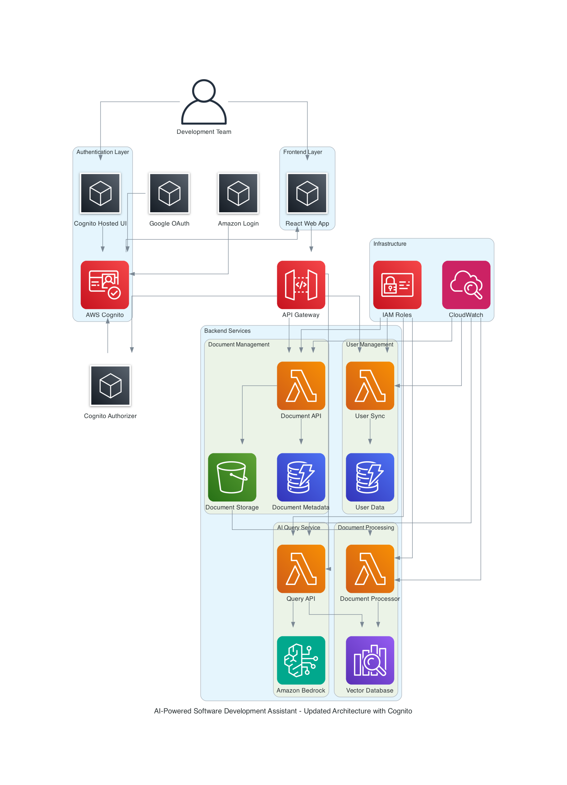

# AI-Powered Software Development Assistant

## Introduction

This project implements an AI-powered software development assistant that enables different personas in software development to ask questions related to development guidelines, SOPs, team knowledge articles, and more. The system provides instant assistance to development teams by answering questions about requirements, architecture, SOPs, and other development-related topics through natural language processing.

The solution is part of the broader AI-Powered SDLC initiative and focuses on the "All phases" category, specifically addressing the need for a centralized knowledge repository and intelligent assistance system for software development teams.

## Solution Architecture



### Architecture Overview

The solution follows a serverless architecture pattern using AWS services:

1. **Frontend Layer**: React-based web application with AWS Amplify integration
2. **Authentication Layer**: AWS Cognito User Pools with federated identity providers (Google, Amazon)
3. **API Layer**: Amazon API Gateway with Cognito authorizer
4. **Backend Services**: AWS Lambda functions for different capabilities
5. **Data Layer**: Amazon DynamoDB for metadata, Amazon S3 for document storage
6. **AI Processing**: Amazon Bedrock for natural language processing and Amazon OpenSearch for vector search
7. **Monitoring**: Amazon CloudWatch for logging and monitoring

### Key Components

#### 1. Authentication & Authorization
- **AWS Cognito User Pools** for user management
- **Federated Login** support for Google and Amazon accounts
- **JWT Token Management** for secure API access
- **Role-based Access Control** for different user types

#### 2. Document Management
- **Multi-format Support**: PDF, Word, Markdown, and text files
- **Intelligent Processing**: Automatic text extraction and chunking
- **Vector Embeddings**: Generated using Amazon Bedrock Titan Embeddings
- **Semantic Search**: Powered by Amazon OpenSearch Serverless

#### 3. AI-Powered Q&A System
- **Natural Language Processing**: Using Amazon Bedrock Claude 3 Haiku
- **Context-Aware Responses**: Based on uploaded documents and knowledge base
- **Conversation History**: Maintained for better user experience
- **Real-time Chat Interface**: WebSocket-based communication

#### 4. Knowledge Repository
- **Centralized Storage**: All team knowledge in one accessible location
- **Intelligent Indexing**: Automatic categorization and tagging
- **Version Control**: Document versioning and change tracking
- **Access Control**: User-based document access permissions

### Architecture Steps Explanation

1. **User Authentication**: Users authenticate via Cognito (email/password, Google, or Amazon)
2. **Document Upload**: Users upload documents through the React frontend
3. **Document Processing**: Lambda functions extract text and generate embeddings
4. **Vector Storage**: Embeddings stored in OpenSearch for semantic search
5. **Query Processing**: User questions processed through Bedrock AI
6. **Response Generation**: AI generates contextual responses based on document content
7. **Real-time Delivery**: Responses delivered through WebSocket connections

## Prerequisites

### AWS Account Setup
- AWS Account with appropriate permissions
- AWS CLI configured with credentials
- Access to the following AWS services:
  - Amazon Cognito
  - Amazon Bedrock (Claude 3 Haiku model access)
  - AWS Lambda
  - Amazon API Gateway
  - Amazon DynamoDB
  - Amazon S3
  - Amazon OpenSearch Serverless
  - Amazon CloudWatch

### Development Environment
- Node.js 18+ and npm
- AWS CDK v2
- Git
- VS Code or preferred IDE

### External Service Credentials
- Google OAuth 2.0 application credentials
- Amazon Login with Amazon (LWA) credentials
- Domain name for production deployment (optional)

### Required Permissions
- IAM permissions for deploying AWS resources
- Bedrock model access permissions
- S3 bucket creation and management permissions

## Deployment Instructions

### Step 1: Clone and Setup
```bash
# Clone the repository
git clone <repository-url>
cd ai-powered-sd

# Install dependencies
npm install

# Install CDK globally if not already installed
npm install -g aws-cdk
```

### Step 2: Configure Environment
```bash
# Copy environment template
cp .env.example .env

# Edit .env file with your configuration
# - AWS region
# - Google OAuth credentials
# - Amazon LWA credentials
# - Other required parameters
```

### Step 3: Deploy Infrastructure
```bash
# Bootstrap CDK (first time only)
cdk bootstrap

# Deploy the stack
cdk deploy --all

# Note the outputs for frontend configuration
```

### Step 4: Configure Frontend
```bash
# Navigate to frontend directory
cd frontend

# Install dependencies
npm install

# Configure Amplify with deployed resources
npm run configure

# Start development server
npm start
```

### Step 5: Setup Identity Providers
1. **Google OAuth Setup**:
   - Create project in Google Cloud Console
   - Enable Google+ API
   - Create OAuth 2.0 credentials
   - Add redirect URIs from Cognito

2. **Amazon LWA Setup**:
   - Create application in Amazon Developer Console
   - Configure Login with Amazon
   - Add redirect URIs from Cognito

### Step 6: Initial Data Setup
```bash
# Upload initial documents (optional)
npm run upload-docs

# Verify deployment
npm run test-deployment
```

## Test

### Unit Tests
```bash
# Run backend unit tests
cd backend
npm test

# Run frontend unit tests
cd frontend
npm test
```

### Integration Tests
```bash
# Run integration tests
npm run test:integration

# Test authentication flows
npm run test:auth

# Test document processing
npm run test:documents

# Test AI query system
npm run test:ai
```

### End-to-End Tests
```bash
# Run E2E tests
npm run test:e2e

# Test complete user workflows
npm run test:workflows
```

### Performance Tests
```bash
# Run load tests
npm run test:load

# Test concurrent users
npm run test:concurrent
```

## Usage Examples

### Document Upload
1. Log in to the application
2. Navigate to document upload section
3. Drag and drop files or browse to select
4. Wait for processing completion
5. Documents become searchable in the knowledge base

### AI Assistant Queries
1. Access the chat interface
2. Type natural language questions about your documents
3. Receive contextual responses with source attribution
4. Continue conversations with follow-up questions

### Knowledge Management
1. View uploaded documents in the management interface
2. Search and filter documents by type, date, or content
3. Update document metadata and tags
4. Delete outdated documents

## Clean Up

### Remove AWS Resources
```bash
# Destroy CDK stack
cdk destroy --all

# Confirm deletion of all resources
# Note: Some resources like S3 buckets may need manual cleanup if they contain data
```

### Manual Cleanup (if needed)
1. Empty and delete S3 buckets
2. Delete Cognito User Pool (if not automatically deleted)
3. Remove any custom IAM roles or policies
4. Delete CloudWatch log groups (optional)

### Local Cleanup
```bash
# Remove node_modules
rm -rf node_modules
rm -rf frontend/node_modules
rm -rf backend/node_modules

# Remove build artifacts
rm -rf build
rm -rf dist
rm -rf cdk.out
```

## Security

This project implements security best practices including:

- **Authentication**: Multi-provider authentication with AWS Cognito
- **Authorization**: Role-based access control and API authorization
- **Data Encryption**: Encryption at rest and in transit for all data
- **Input Validation**: Comprehensive input validation and sanitization
- **API Security**: Rate limiting, CORS configuration, and security headers
- **Audit Logging**: Complete audit trail of all user actions

See [CONTRIBUTING](CONTRIBUTING.md) for more information about security practices and reporting vulnerabilities.

## License

This library is licensed under the MIT-0 License. See the [LICENSE](LICENSE) file for details.

## Disclaimer

_"The solution architecture sample code is provided without any guarantees, and you're not recommended to use it for production-grade workloads. The intention is to provide content to build and learn. Be sure of reading the licensing terms."_

## Contributing

We welcome contributions to improve this AI-powered software development assistant. Please read our [Contributing Guidelines](CONTRIBUTING.md) for details on:

- Code of conduct
- Development process
- Pull request process
- Security vulnerability reporting

## Support

For questions, issues, or feature requests:

1. Check existing [Issues](../../issues) for similar problems
2. Create a new issue with detailed description
3. Follow the issue template for faster resolution

## Project Structure

```
ai-powered-sd/
├── 01_user_stories/          # User stories and requirements
├── 02_architecture/          # Architecture documentation
├── 03_development_plan/      # Development planning documents
├── backend/                  # Backend Lambda functions
├── frontend/                 # React frontend application
├── infrastructure/           # AWS CDK infrastructure code
├── docs/                     # Additional documentation
├── tests/                    # Test files
└── README.md                # This file
```

## Technology Stack

- **Frontend**: React 18, TypeScript, AWS Amplify, Tailwind CSS
- **Backend**: Node.js 18, AWS Lambda, TypeScript
- **Database**: Amazon DynamoDB, Amazon S3
- **AI/ML**: Amazon Bedrock (Claude 3 Haiku), Amazon OpenSearch Serverless
- **Authentication**: AWS Cognito with federated identity providers
- **Infrastructure**: AWS CDK, CloudFormation
- **Monitoring**: Amazon CloudWatch, AWS X-Ray

## Performance Characteristics

- **Concurrent Users**: Supports 30+ simultaneous users
- **Response Time**: < 3 seconds average for AI queries
- **Document Processing**: < 2 minutes for typical documents
- **System Availability**: > 99.5% uptime target
- **Scalability**: Serverless architecture with automatic scaling

## Cost Considerations

Estimated monthly costs for 50 active users:
- AWS Cognito: ~$25
- AWS Lambda: ~$20
- Amazon DynamoDB: ~$15
- Amazon S3: ~$10
- Amazon Bedrock: ~$50
- Amazon OpenSearch: ~$100
- Other services: ~$25

**Total**: ~$245/month (costs may vary based on usage patterns)

## Roadmap

Future enhancements planned:
- Advanced analytics and reporting
- Integration with additional development tools
- Mobile application support
- Advanced AI capabilities and models
- Enterprise features and compliance
- Multi-language support

---

For more detailed information, please refer to the documentation in the respective directories or contact the development team.
