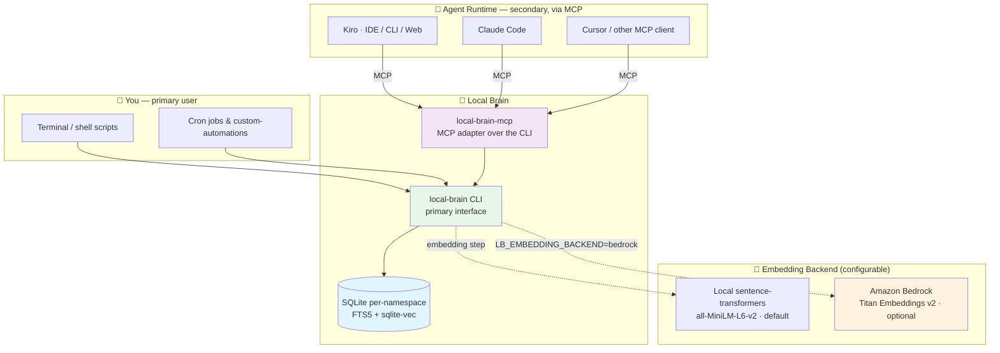

# Local Brain — Persistent Agent Memory for the AI-Powered SDLC

## Introduction

Local Brain is a **CLI** that gives you and your AI coding agents **persistent, queryable, semantically-searchable memory** across sessions — backed entirely by SQLite on your own machine. No vector database to provision, no service to deploy, no additional authentication surface to manage. (See [Security Considerations](#security-considerations) for the on-disk storage posture.)

The `local-brain` CLI is the primary interface. You use it directly from your shell, from scripts, and from cron jobs to save, search, and curate memory. A bundled MCP server (`local-brain-mcp`) exposes the same operations to MCP-compatible agent runtimes ([Kiro](https://kiro.dev/), Claude Code, Cursor) so they can read and write that same memory store — but the CLI is what holds the data, runs the embeddings, and drives the automations. Reads are direct SQL — milliseconds, offline-capable, no daemon. Embeddings default to a local `sentence-transformers` model (offline, free) but can optionally use **Amazon Bedrock Titan Embeddings v2** when you want managed inference.

This repository is the public reference implementation extracted from a production internal deployment.

#### 🎯 What this pattern solves

AI coding agents are stateless between sessions. Every time you open a new chat, the agent has forgotten:

- The architectural decisions you made yesterday
- The file conventions it learned from your codebase
- The user preferences it inferred ("don't add unsolicited tests", "use my company's style guide")
- The cross-project insights it built up over weeks of work

Most teams reach for a hosted vector DB (OpenSearch, Pinecone, Weaviate) or shove everything into a single context file. Both approaches break: hosted vector DBs add cost, latency, and an additional authentication surface to manage for what is fundamentally a *personal* knowledge store; flat context files don't scale past a few hundred entries and have no semantic recall.

**Local Brain inverts the model.** Memory is per-user, on-disk, namespaced, queryable from any agent runtime, and the only thing that needs to be online is the embedding step (and even that is local by default).

## Solution Architecture

### How it works

Everything routes through the **`local-brain` CLI**. You drive it directly from your shell or scripts; an agent reaches the same operations through the bundled MCP server, which is just a thin adapter over the CLI's surface.

1. **Save** — `local-brain memory save` writes a memory to a namespace. The CLI inserts a row into `~/.local-brain/<namespace>/memories.db` with FTS5 indexing applied immediately. Callers: you (interactively), shell scripts, cron jobs, or an agent via MCP.
2. **Embed** — periodically (or on-demand), `local-brain embeddings backfill` reads memories that don't yet have an embedding and writes vectors into a `sqlite-vec` virtual table. Default model is local `all-MiniLM-L6-v2` (384-dim, CPU). Set `LB_EMBEDDING_BACKEND=bedrock` to use **Amazon Titan Embeddings v2** instead.
3. **Search** — `local-brain memory search` runs keyword (FTS5), semantic (sqlite-vec), or hybrid (RRF combination) queries. Returns ranked matches as JSON. Use it from your terminal to inspect what your agent has learned, from shell pipelines, or from agents via MCP.
4. **Recall** — your agent loads relevant memories at session start, or on-demand mid-conversation, via the bundled MCP server — which fans out to the same CLI primitives above.

### AWS-services architecture (Bedrock-optional path)



### Where the AI-DLC value lands

| SDLC phase | What Local Brain enables |
|---|---|
| **Implementation** | Agents recall past architectural decisions and code conventions across sessions, reducing rework and inconsistency |
| **Testing** | Agents remember which test fixtures, mock patterns, and skip-rules apply to your codebase |
| **Operation & Maintenance** | Cron-driven memory automations summarize daily activity into searchable insights — "what did I ship last week?" answerable from the agent without scanning git logs |
| **Cross-cutting** | Agents accumulate user preferences ("don't add comments unless requested", "use company X's style guide") that persist across every project |

## Installation

### Prerequisites

- Go 1.26.3 or newer
- Python 3.11+ (for local embedding step) with `pip install sqlite-vec sentence-transformers`
- (Optional) AWS credentials with `bedrock:InvokeModel` permission for Titan Embeddings v2 if using the Bedrock backend

### Build from source

```bash
git clone https://github.com/aws-samples/sample-ai-powered-sdlc-patterns-with-aws.git
cd sample-ai-powered-sdlc-patterns-with-aws/implementation/implement-agent-memory-local-brain
go build -o local-brain ./cmd/local-brain-pp-cli
go build -o local-brain-mcp ./cmd/local-brain-pp-mcp
```

Move the binaries somewhere on your `$PATH` (e.g. `~/bin/` or `/usr/local/bin/`).

### One-time init

```bash
local-brain init
# Creates ~/.local-brain/, vendored embedder script, default config
```

### Verify the CLI works (no agent required)

The CLI is fully usable on its own — try it before wiring any agent:

```bash
local-brain memory save \
  --namespace test \
  --type insight \
  --content "Local Brain installed and working"

local-brain memory search "installed" --namespace test
local-brain doctor
```

If those three commands succeed, you have a working personal memory store. The MCP server below is purely additive — it lets agents reach the same store.

### (Optional) Wire up your agent via MCP

Don't have an agent runtime yet? Install [Kiro](https://kiro.dev/):
```bash
curl -fsSL https://cli.kiro.dev/install | bash
# or download the IDE from https://kiro.dev/
```

For **Claude Code**, add to `~/.claude.json` under `mcpServers`:
```json
{
  "mcpServers": {
    "local-brain": {
      "command": "local-brain-mcp",
      "args": []
    }
  }
}
```

For **[Kiro](https://kiro.dev/)** (IDE / CLI / Web), add to `~/.kiro/settings/mcp.json`:
```json
{
  "mcpServers": {
    "local-brain": { "command": "local-brain-mcp", "args": [] }
  }
}
```

## Quick Start

```bash
# 1. Save a memory
local-brain memory save \
  --namespace project/my-app \
  --type insight \
  --content "API gateway uses Cognito JWT in Authorization header, NOT Bearer"

# 2. Search keyword
local-brain memory search "Cognito JWT" --namespace project/my-app

# 3. Generate embeddings (default = local sentence-transformers)
local-brain embeddings backfill --all

# 4. Semantic search
local-brain memory search "how do we authenticate" --namespace project/my-app --mode semantic

# 5. Use Bedrock instead of local model (optional)
export LB_EMBEDDING_BACKEND=bedrock
export AWS_REGION=us-east-1
local-brain embeddings backfill --all
```

## Command Reference

| Command | Description |
|---|---|
| `local-brain init` | One-time setup: creates `~/.local-brain/`, vendors helper scripts, writes default config |
| `local-brain memory save` | Save a memory (insight / decision / outcome / action_item / preference / compiled) to a namespace |
| `local-brain memory list` | List memories in a namespace, most recent first |
| `local-brain memory search` | Search by keyword (FTS5), semantic (sqlite-vec), or hybrid (RRF) |
| `local-brain memory get` | Fetch a single memory by ID, searching across all namespaces if none specified |
| `local-brain memory forget` | Delete a memory by ID |
| `local-brain memory context` | Load all memories for a namespace (alias for list with default limit 50) |
| `local-brain memory dedupe` | Find duplicate memories by content hash across namespaces |
| `local-brain memory patterns` | Find tags appearing across multiple namespaces |
| `local-brain memory bisect` | Show the atomic memories that synthesized a compiled memory |
| `local-brain memory stale` | List action_item memories older than N days |
| `local-brain memory watch` | Tail new memories as they're written (live mode) |
| `local-brain embeddings backfill` | Generate embeddings for memories that don't have them yet |
| `local-brain embeddings status` | Per-namespace coverage report |
| `local-brain embeddings rebuild` | Drop and regenerate embeddings for a namespace |
| `local-brain doctor` | Composite health check (binary, Python deps, sqlite-vec extension, embedder script) |
| `local-brain custom-automation` | Create / update / delete / run-now / logs for user-defined scheduled prompts |
| `local-brain automation memory` | Enable / disable / status of the 9 bundled memory automations (compiler, indexer, linter, etc.) |

Every command supports `--json`, `--select <fields>`, `--dry-run`, and `--no-color`. Pass `--agent` to enable agent-friendly defaults (JSON output, no prompts).

## Memory Types

| Type | Use for |
|---|---|
| `insight` | Facts your agent learned about the code, customer, or domain |
| `decision` | Architectural / design choices, with rationale |
| `outcome` | Results of an action — what shipped, what broke, what got measured |
| `action_item` | Open work items with optional due dates |
| `preference` | User behavior rules ("never edit X without asking", "prefer Y over Z") |
| `compiled` | Synthesized rollups of multiple atomic memories |

## Embedding Backends

Configurable via `LB_EMBEDDING_BACKEND` env var or `~/.local-brain/config.json`:

| Backend | When to use | Cost | Latency |
|---|---|---|---|
| `local` (default) | Privacy-sensitive, offline, free, fast enough for personal scale | $0 | ~30ms / batch on CPU |
| `bedrock` | Higher quality embeddings, no local Python dependency, scales to team usage | ~$0.0001 / 1K tokens (Titan v2) | ~150ms / batch network round-trip |

Local backend uses `sentence-transformers/all-MiniLM-L6-v2` (384-dim).
Bedrock backend uses `amazon.titan-embed-text-v2:0` (configurable to 256/512/1024 dims).

When switching backends, run `local-brain embeddings rebuild --namespace <ns>` — vectors are not interchangeable across models.

## Custom Automations

`local-brain custom-automation` lets you define recurring agent prompts as cron-scheduled tasks. Each automation has:
- A natural-language prompt
- A schedule (`daily@10:07`, `hourly:13`, `weekly:Mon@9:00`)
- An agent invocation template (driven by `LB_AGENT_CLI` and `LB_AGENT_NAME` env vars — point them at your preferred agent runtime)
- A log directory under `~/.local-brain/logs/automations/<id>/`

Example:
```bash
export LB_AGENT_CLI=kiro       # Kiro CLI (or claude-code, cursor, etc.)
export LB_AGENT_NAME=default   # agent profile to invoke

local-brain custom-automation create \
  --name "daily-brief" \
  --prompt "Summarize what I shipped yesterday from git log + memories" \
  --schedule "daily@7:30"

local-brain custom-automation logs daily-brief --tail 200
```

This is the killer pattern for AI-powered SDLC: **the agent runs while you sleep**, the memory grows while you sleep, and the next morning's session starts with yesterday's context already searchable.

## Security Considerations

Local Brain stores **plaintext memory content** on disk along with its FTS5 index and (when generated) sentence embeddings. The on-disk layout is per-user and not encrypted at rest beyond your operating system's filesystem permissions. Treat `~/.local-brain/` like any other user-private data directory.

### On-disk data protection

- **Filesystem permissions:** All directories Local Brain creates use `0o700` (owner-only access). Do not relax these.
- **What's stored:** memory `content` (plaintext, exactly as written by your agent), tags, source labels, FTS5 index entries, and 384-dim embedding vectors. Each row also stores a content hash for dedup.
- **What's NOT stored:** API keys, agent runtime credentials, or any secrets. Your agent runtime (Kiro, Claude Code, etc.) is responsible for not writing secrets into memory content. Sanitize agent outputs before saving if untrusted text could reach them.
- **Backup posture:** If you back up `~/.local-brain/`, your backup target inherits this sensitivity. Use encrypted backups or exclude the directory.
- **Multi-user systems:** Each OS user has their own `~/.local-brain/`. Never share the directory between users — semantic search across another user's memories is a privacy violation.

### Bedrock backend (optional)

When `LB_EMBEDDING_BACKEND=bedrock` is set, the embedding step calls `bedrock:InvokeModel` for the configured embedding model.

- **Recommended IAM posture:** least-privilege. Scope your IAM policy to the **specific model ARN** rather than `bedrock:InvokeModel` on `*`:
  ```json
  {
    "Version": "2012-10-17",
    "Statement": [{
      "Effect": "Allow",
      "Action": "bedrock:InvokeModel",
      "Resource": "arn:aws:bedrock:us-east-1::foundation-model/amazon.titan-embed-text-v2:0"
    }]
  }
  ```
- **Region scoping:** further constrain via the `Resource` ARN's region segment to the region you actually call.
- **Memory content leaves your machine:** the Bedrock backend sends memory text to AWS for embedding inference. Local backend (`LB_EMBEDDING_BACKEND=local`, the default) keeps everything on-device.

### Open-source dependencies

- **`sentence-transformers/all-MiniLM-L6-v2`** — Apache-2.0 (model card: https://huggingface.co/sentence-transformers/all-MiniLM-L6-v2)
- **`sqlite-vec`** — Apache-2.0 (https://github.com/asg017/sqlite-vec)
- **`go-sqlite3`** — MIT (https://github.com/mattn/go-sqlite3)

All Apache-2.0 / MIT — review your organization's approved-OSS list before redistributing.

## Architecture Files

| Path | Purpose |
|---|---|
| `cmd/local-brain-pp-cli/` | CLI entry point |
| `cmd/local-brain-pp-mcp/` | MCP server entry point |
| `internal/brain/` | SQLite store, FTS5 + sqlite-vec helpers, embedder shell-out |
| `internal/cli/` | Cobra subcommand implementations |
| `internal/cli/scripts/` | Vendored Python embedder + automation runners |
| `internal/mcp/` | MCP tool definitions exposed to agent runtimes |
| `internal/brain/automation/` | Custom automation lifecycle (cron → launchd / systemd) |

## Disclaimer

This is sample code. It is not warranted for production-grade workloads — review the architecture, test under your security model, and adapt to your environment. See [Security Considerations](#security-considerations) for the on-disk storage posture and IAM guidance for the Bedrock backend. Bedrock pricing — see [AWS Pricing](https://aws.amazon.com/bedrock/pricing/).

## License

MIT No Attribution. See [LICENSE](LICENSE).
