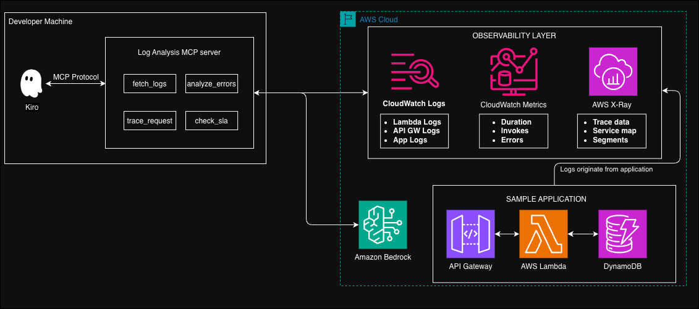

# AI-Powered Log Aggregation and Analysis MCP Server

## Introduction

This solution provides an MCP (Model Context Protocol) server that enables developers to analyze application logs directly from their terminal using AI-powered insights. It integrates with Amazon Bedrock for intelligent log analysis, pattern detection, and anomaly identification.

**Key Features:**

- Analyze logs without leaving your development environment
- AI-powered error pattern detection and root cause analysis
- Cross-service request tracing with X-Ray correlation
- SLA compliance monitoring with automated threshold checks

### MCP Server Tools

| Tool             | Description                                                          | Parameters                                                                                |
| ---------------- | -------------------------------------------------------------------- | ----------------------------------------------------------------------------------------- |
| `fetch_logs`     | Fetch logs from CloudWatch for a specific log group and time range   | `log_group` (required), `start_time`, `end_time`, `filter_pattern`, `limit`               |
| `analyze_errors` | AI-powered error analysis with pattern detection and fix suggestions | `log_group` (required), `time_range`, `error_types`                                       |
| `trace_request`  | Trace requests across services using X-Ray and correlate logs        | `trace_id`, `request_id`, `time_range`                                                    |
| `check_sla`      | Check metrics against SLA thresholds                                 | `service_name` (required), `metric_type` (required), `threshold` (required), `time_range` |

### AWS Services Used

- **Amazon CloudWatch** - Log storage, querying, and performance metrics
- **AWS X-Ray** - Distributed tracing
- **Amazon Bedrock** - AI-powered log analysis (Claude 3 Haiku)
- **AWS Lambda** - Sample application (for demo)
- **Amazon API Gateway** - Sample API endpoint
- **Amazon DynamoDB** - Sample data store

## Solution Architecture



### Architecture Flow

1. **Developer Interaction**: Developer uses Kiro CLI to query logs or request analysis
2. **MCP Protocol**: Kiro CLI communicates with the Log Analysis MCP Server running locally
3. **AWS SDK Calls**: MCP Server makes API calls to AWS services:
   - CloudWatch Logs for log retrieval
   - CloudWatch for SLA metric checks
   - X-Ray for distributed tracing
   - Amazon Bedrock for AI-powered analysis
4. **AI Analysis**: For `analyze_errors` and `trace_request`, logs are sent to Amazon Bedrock (Claude 3 Haiku) for intelligent analysis
5. **Sample Application**: The included CDK stack deploys API Gateway → Lambda → DynamoDB that generates logs for testing

## Prerequisites

- Python 3.10+
- Node.js 18+ (for CDK)
- AWS CLI configured with appropriate credentials
- AWS CDK CLI (`npm install -g aws-cdk`)
- Kiro CLI installed

### Required IAM Permissions

```json
{
  "Version": "2012-10-17",
  "Statement": [
    {
      "Sid": "CloudWatchLogsAccess",
      "Effect": "Allow",
      "Action": [
        "logs:FilterLogEvents",
        "logs:DescribeLogGroups",
        "logs:GetLogEvents"
      ],
      "Resource": "arn:aws:logs:*:*:log-group:*"
    },
    {
      "Sid": "CloudWatchMetricsAccess",
      "Comment": "CloudWatch Metrics actions do not support resource-level permissions",
      "Effect": "Allow",
      "Action": ["cloudwatch:GetMetricStatistics", "cloudwatch:GetMetricData"],
      "Resource": "*",
      "Condition": {
        "StringEquals": { "aws:RequestedRegion": "${AWS_REGION}" }
      }
    },
    {
      "Sid": "XRayTraceAccess",
      "Comment": "X-Ray read actions do not support resource-level permissions",
      "Effect": "Allow",
      "Action": ["xray:BatchGetTraces", "xray:GetTraceSummaries"],
      "Resource": "*",
      "Condition": {
        "StringEquals": { "aws:RequestedRegion": "${AWS_REGION}" }
      }
    },
    {
      "Sid": "BedrockModelAccess",
      "Effect": "Allow",
      "Action": "bedrock:InvokeModel",
      "Resource": "arn:aws:bedrock:*::foundation-model/anthropic.claude-3-haiku*"
    }
  ]
}
```

> **Note:** Replace `${AWS_REGION}` with your target region (e.g., `us-east-1`). CloudWatch Metrics and X-Ray read actions do not support resource-level permissions, so `Resource: "*"` is required. The `Condition` key restricts access to a single region.

## Deployment Instructions

### 1. Deploy Sample Application (Optional)

The CDK stack deploys a sample Lambda + API Gateway that generates various log patterns for testing.

```bash
cd cdk
npm install
cdk bootstrap  # If not already done
cdk deploy
```

Note the outputs:

- `ApiUrl` - Sample API endpoint
- `LambdaLogGroup` - Log group name for testing
- `LambdaName` - Function name for SLA checks

### 2. Install MCP Server

```bash
cd mcp-server
python3 -m venv .venv
source .venv/bin/activate  # On Windows: .venv\Scripts\activate
pip install -r requirements.txt
```

### 3. Configure Kiro CLI

Add to your Kiro MCP configuration (`~/.kiro/settings/mcp.json`):

```json
{
  "mcpServers": {
    "log-analysis": {
      "command": "/path/to/mcp-server/.venv/bin/python",
      "args": ["/path/to/mcp-server/server.py"],
      "env": {
        "AWS_REGION": "us-east-1",
        "LOG_GROUP_ALLOWLIST": "/aws/lambda/,/aws/apigateway/",
        "REQUIRE_TEMP_CREDENTIALS": "true"
      },
      "disabled": false
    }
  }
}
```

Replace `/path/to/mcp-server` with the actual path to the `mcp-server` directory.

#### Environment Variables

| Variable                   | Description                                                                            | Default                                  |
| -------------------------- | -------------------------------------------------------------------------------------- | ---------------------------------------- |
| `AWS_REGION`               | AWS region for API calls                                                               | Required                                 |
| `LOG_GROUP_ALLOWLIST`      | Comma-separated prefixes of allowed log groups (e.g., `/aws/lambda/,/aws/apigateway/`) | All groups allowed                       |
| `REQUIRE_TEMP_CREDENTIALS` | Set to `true` to warn when long-lived access keys are used                             | `false`                                  |
| `BEDROCK_MODEL_ID`         | Bedrock model ID for AI analysis                                                       | `anthropic.claude-3-haiku-20240307-v1:0` |

### 4. Configure AWS Credentials (Recommended: Temporary Credentials)

The MCP server checks credential safety at startup and warns if you're using long-lived access keys or overly permissive policies.

**Option A: Use the CDK-deployed least-privilege role (recommended)**

```bash
# Get the role ARN from CDK output
ROLE_ARN=$(aws cloudformation describe-stacks --stack-name LogAnalysisSampleApp \
  --query 'Stacks[0].Outputs[?OutputKey==`McpServerRoleArn`].OutputValue' --output text)

# Configure a profile that assumes the role
aws configure set profile.mcp-server.role_arn "$ROLE_ARN"
aws configure set profile.mcp-server.source_profile default
```

Then set `AWS_PROFILE=mcp-server` in the MCP server env config.

**Option B: Use AWS SSO / IAM Identity Center**

```bash
aws sso login --profile your-sso-profile
```

Then set `AWS_PROFILE=your-sso-profile` in the MCP server env config.

**Avoid**: Using long-lived IAM user access keys directly. If you must, scope them with the least-privilege policy above.

### 4. Generate Test Logs

Invoke the sample API to generate logs:

```bash
# Get the API URL from CDK output
API_URL=$(aws cloudformation describe-stacks --stack-name LogAnalysisSampleApp --query 'Stacks[0].Outputs[?OutputKey==`ApiUrl`].OutputValue' --output text)

# Generate traffic
for i in {1..20}; do curl -s $API_URL; sleep 1; done
```

## Test

After configuring Kiro CLI, restart it and test with these prompts.

### Retrieve Sample App Values

If you deployed the sample application, grab the log group and function name from the CDK stack outputs:

```bash
# Get the Lambda log group name
LOG_GROUP=$(aws cloudformation describe-stacks --stack-name LogAnalysisSampleApp \
  --query 'Stacks[0].Outputs[?OutputKey==`LambdaLogGroup`].OutputValue' --output text)
echo "Log Group: $LOG_GROUP"

# Get the Lambda function name
LAMBDA_NAME=$(aws cloudformation describe-stacks --stack-name LogAnalysisSampleApp \
  --query 'Stacks[0].Outputs[?OutputKey==`LambdaName`].OutputValue' --output text)
echo "Lambda Name: $LAMBDA_NAME"
```

Use these values in the test prompts below (replace the placeholders).

### Fetch Logs

```
fetch logs from /aws/lambda/<your-lambda-log-group> for the last hour
```

### Analyze Errors

```
analyze errors in /aws/lambda/<your-lambda-log-group> and tell me what's wrong
```

### Check SLA

```
check if <your-lambda-name> meets a 5% error rate SLA
```

### Example Output (analyze_errors)

```
The analysis shows your Lambda function has database connection failures:

**The Problem:**
- 7 errors detected in the last hour
- All errors are "Database connection failed"

**Root Cause:**
- Database connection pool exhaustion

**Recommendations:**
1. Increase connection pool size
2. Add retry logic for database connections
3. Consider read replicas for scaling
```

## Clean Up

Remove all deployed resources:

```bash
cd cdk
cdk destroy
```

## Security

See [SECURITY.md](SECURITY.md) for vulnerability reporting and security best practices.
See [CONTRIBUTING](CONTRIBUTING.md) for contribution guidelines.

## License

This library is licensed under the MIT-0 License. See the [LICENSE](LICENSE) file.

## Disclaimer

The solution architecture sample code is provided without any guarantees, and you're not recommended to use it for production-grade workloads. The intention is to provide content to build and learn. Be sure of reading the licensing terms.
