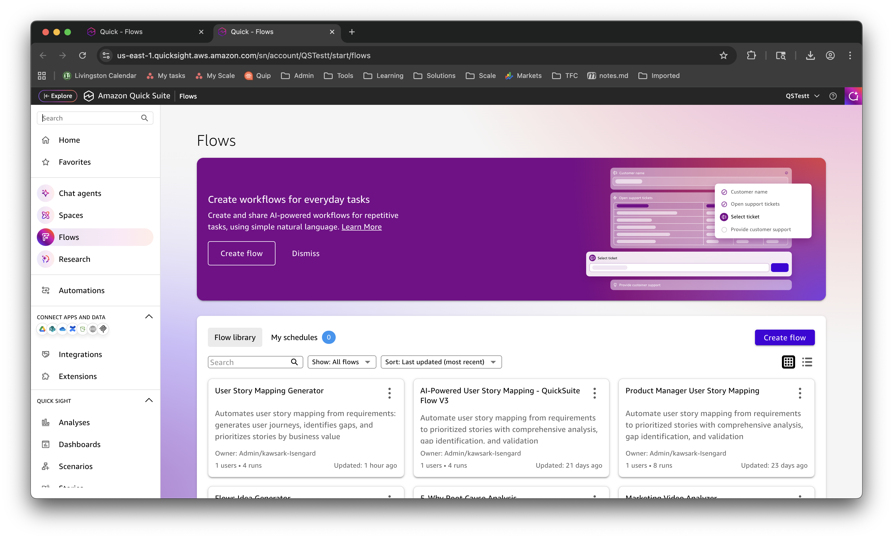
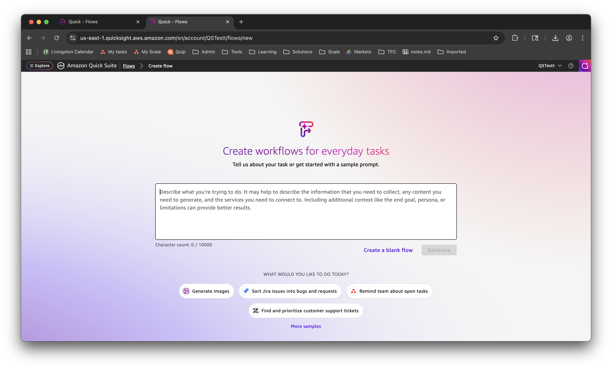
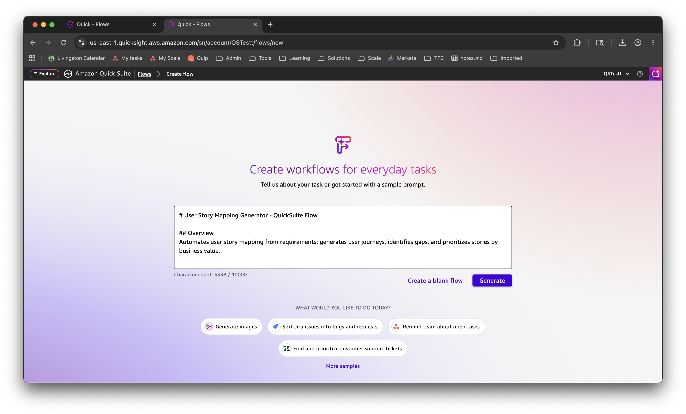
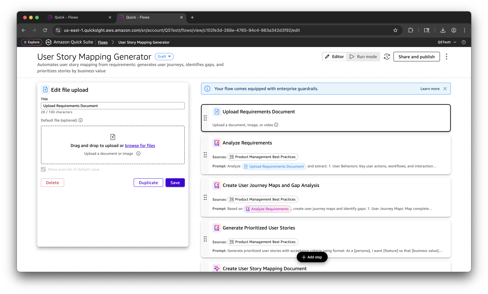
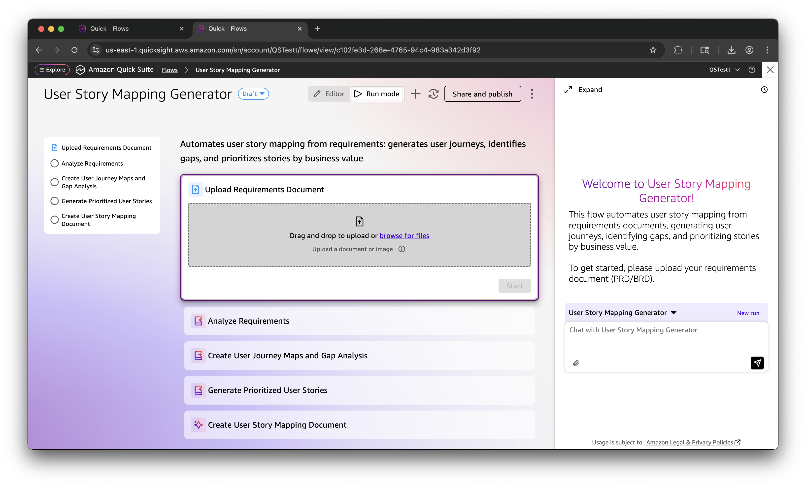

# Creating the User Story Mapping Flow

This guide walks through creating the User Story Mapping Generator flow in Amazon Quick Suite using AI-powered flow generation.

## Prerequisites

- Access to Amazon Quick Suite
- Active Quick Suite subscription
- The flow specification file: `quicksuite-flow-v4.0.md`

---

## Step 1: Navigate to Flows

1. Open Amazon Quick Suite in your browser
2. Click on **Flows** in the left navigation menu
3. You'll see the Flows homepage with existing flows
4. Click the **Create flow** button in the top-right corner

---

## Step 2: Choose Flow Creation Method

1. The "Create workflows for everyday tasks" dialog appears
2. You have two options:
   - **Generate from text**: Use AI to create flow from description (recommended)
   - **Create a blank flow**: Build flow manually step-by-step
3. Click **Create flow** to proceed with AI generation

---

## Step 3: Paste Flow Specification

1. A text input box appears with placeholder text
2. Open the `quicksuite-flow-v4.0.md` file
3. **Copy the entire contents** of the file (5,364 characters)
4. **Paste** into the text box
5. The character count shows: `5338 / 10000` (well under the limit)
6. Click the **Generate** button

**What happens next:**
- Quick Suite's AI analyzes the flow specification
- It automatically creates all 5 flow steps
- It configures step types, prompts, and dependencies
- This takes 10-30 seconds

---

## Step 4: Review Generated Flow (Editor Mode)

After generation completes, you'll see the flow in **Editor mode**:

**Left Panel - Flow Steps:**
1. ✅ Upload Requirements Document (File upload)
2. ✅ Analyze Requirements (Quick Suite data)
3. ✅ Create User Journey Maps and Gap Analysis (Quick Suite data)
4. ✅ Generate Prioritized User Stories (Quick Suite data)
5. ✅ Create User Story Mapping Document (Document generation)

**Center Panel - Step Configuration:**
- Click any step to view/edit its configuration
- Each step shows:
  - Title and description
  - Step type (file upload, Quick Suite data, etc.)
  - Prompt text (for AI-powered steps)
  - Knowledge space connection
  - Dependencies on previous steps

**Customization Options:**
- Click on any step to modify its prompt
- Adjust the AI instructions for your needs
- Add or remove steps using the **+ Add step** button
- Change step order by dragging

**Top Actions:**
- **Editor**: Current mode (edit flow structure)
- **Run mode**: Switch to execution mode
- **Share and publish**: Share with team members

**Customization Options:**

You can easily adapt the flow to your organization's needs:
1. Click on any step in the left panel
2. Modify the prompt text in the center panel
3. Adjust AI instructions, output format, or analysis criteria
4. Click **Save** to preserve changes
5. Test with your requirements in Run mode

**Common Customizations:**
- Modify story format (e.g., Job Stories instead of User Stories)
- Adjust prioritization criteria (e.g., add technical complexity scoring)
- Change acceptance criteria format (e.g., BDD scenarios)
- Add organization-specific validation rules
- Include custom fields (e.g., story points, sprint assignment)

---

## Step 5: Switch to Run Mode

Click **Run mode** to test the flow:

**Left Panel - Step Progress:**
- Shows all 5 steps with status indicators
- Completed steps show checkmarks
- Current step is highlighted
- Upcoming steps are grayed out

**Center Panel - Execution Area:**
- Shows the current step's interface
- For file upload: Drag-and-drop or browse for files
- For AI steps: Shows processing status and output
- For document generation: Shows download button

**Right Panel - Welcome Message:**
- "Welcome to User Story Mapping Generator!"
- Explains what the flow does
- Provides instructions to get started
- Shows chat interface for questions

**Bottom Right:**
- **New run**: Start a fresh execution
- **Chat with User Story Mapping Generator**: Ask questions about the flow

---

## Step 6: Save and Share

1. Click **Save** to save your flow (if not auto-saved)
2. Give your flow a descriptive name: "User Story Mapping Generator"
3. Click **Share and publish** to:
   - Share with team members
   - Set permissions (view/edit/run)
   - Publish to your organization

---

## Next Steps

Your flow is now ready to use! Proceed to the [Running the Flow](RUNNING-THE-FLOW.md) guide to learn how to:
- Upload requirements documents
- Monitor flow execution
- Interact with the flow during processing
- Download generated user story maps

---

## Troubleshooting

**Issue**: "String must contain at most 10000 character(s)" error
- **Solution**: The flow specification is 5,364 characters, well under the limit. Ensure you're copying the correct file (`quicksuite-flow-v4.0.md`)

**Issue**: Flow generation fails or times out
- **Solution**: Try again. If it persists, use "Create a blank flow" and add steps manually

**Issue**: Knowledge space not found
- **Solution**: Create the "Product Management Best Practices" knowledge space first (see main README.md)

**Issue**: Steps are missing or incorrect
- **Solution**: Switch to Editor mode and manually adjust the steps. The AI generation is a starting point that you can customize.
