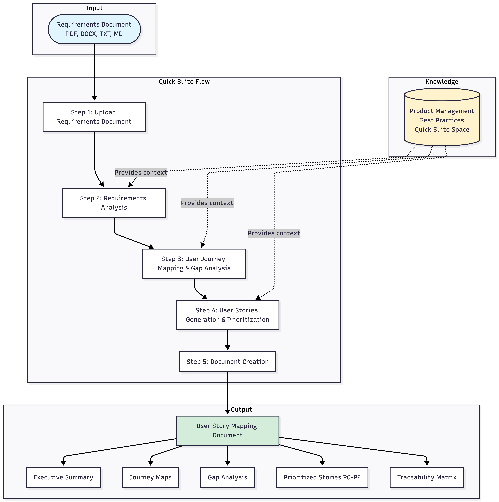
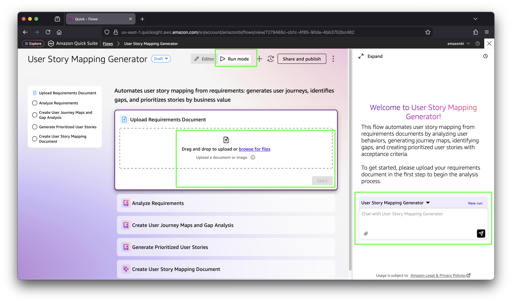
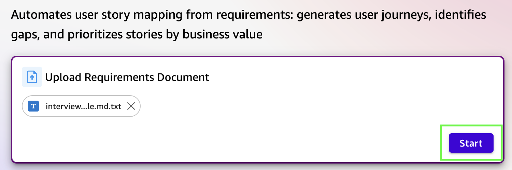

# AI-Powered User Story Mapping with Amazon Quick Suite

## Introduction

This solution automates user story mapping using Amazon Quick Suite Flows and generative AI. It analyzes product requirements documents (PRDs) to generate comprehensive user journey maps, identify gaps in user flows, and create prioritized user stories with acceptance criteria.

**Key Capabilities:**
- Automated user journey mapping from requirements
- Gap analysis (missing features, steps, edge cases)
- User story generation with acceptance criteria
- Priority-based ranking by business value
- Traceability between journeys, features, and stories

**Use Cases:**
- Product managers planning new features
- Business analysts documenting requirements
- Development teams breaking down epics into stories
- Stakeholders reviewing feature completeness

## Solution Architecture

This solution uses Amazon Quick Suite Flows to orchestrate a 5-step workflow:

```
Requirements Document → Analysis → Journey Mapping & Gap Analysis → Story Generation & Prioritization → Documentation
```

### Step-by-Step Flow

1. **Upload Requirements Document** (File Upload)
   - User uploads PRD/BRD in PDF, DOCX, TXT, or MD format
   - Document is stored for analysis

2. **Requirements Analysis** (Quick Suite Data)
   - Extracts user behaviors, business requirements, success criteria, and personas
   - Uses "Product Management Best Practices" knowledge space
   - Outputs structured analysis with key workflows and features

3. **User Journey Mapping & Gap Analysis** (Quick Suite Data)
   - Creates complete user journey maps with steps and touchpoints
   - Identifies missing features, workflow steps, and edge cases
   - Generates comprehensive feature list including gap-filling features

4. **User Stories Generation & Prioritization** (Quick Suite Data)
   - Generates 10-20 user stories with acceptance criteria
   - Prioritizes by business value (P0/P1/P2)
   - Links stories to journeys and gaps for traceability
   - Uses Given-When-Then format for acceptance criteria

5. **Document Creation** (Document Generation)
   - Creates comprehensive user story mapping document
   - Includes executive summary, journey maps, gap analysis, and prioritized stories
   - Provides traceability matrix and next steps

### Architecture Diagram



## Prerequisites

- **AWS Account** with Amazon Quick Suite access
- **Amazon Quick Suite** subscription (per-user pricing)
- **Permissions**: Ability to create spaces and flows in Quick Suite

## Deployment Instructions

The deployment consists of two one-time setup steps followed by running the flow:

### Step 1: Create the Quick Suite Space (One-time setup)

Create a Quick Suite space to provide custom knowledge and context to the AI. A space is a centralized knowledge hub where you can upload company-specific information, templates, and guidelines that customize how the AI generates user stories.

**What you'll do**: Create a space named "Product Management Best Practices" and upload knowledge content (user story templates, agile guidelines, gap analysis frameworks, and prioritization methodologies).

**Detailed guide**: [Creating the Space](creating-the-space.md)

**Why this matters**: The space allows you to customize the AI's behavior and output format. Upload your organization's product details, brand guidelines, terminology, story format templates, UI mockups, design systems, or any reference materials. The AI will use this context to generate stories that match your standards and include relevant product details, making the output immediately usable without extensive editing.

### Step 2: Create the Flow (One-time setup)

Create the User Story Mapping Generator flow using AI-powered generation from a text specification.

**What you'll do**: Use Quick Suite's "Generate from text" feature to create a 5-step automated flow from the provided specification file (`quicksuite-flow-v4.0.md`).

**Detailed guide**: [Creating the Flow](creating-the-flow.md)

### Step 3: Run the Flow

Once the flow is set up, you can run it anytime to generate user story maps from requirements documents.

**What you'll do**: Click "Run mode" in your flow, upload a requirements document (PDF, DOCX, TXT, or MD), and click "Start" to begin the automated analysis.





The flow will automatically:
1. Analyze your requirements document
2. Generate user journey maps
3. Identify gaps in workflows and features
4. Create prioritized user stories (P0/P1/P2)
5. Produce a comprehensive user story mapping document

**Detailed guide**: [Running the Flow](running-the-flow.md)

### Step 4: Share with Team (Optional)

Share the flow with your team members so they can run it independently.

1. Open your flow in Quick Suite
2. Click **Share and publish** button
3. Add team members who need access
4. Set appropriate permissions (view/edit/run)
5. Team members can now access and run the flow from their Quick Suite dashboard

## Test

### Test with Sample PRDs

A sample PRD is provided in the `use-case-examples/` directory:

**Interview Scheduling** (`interview-scheduling-prd-simple.md.txt`)
- Tests: Scheduling workflows, calendar integration, notifications
- Expected output: ~15-20 user stories with P0-P2 priorities

### Testing Steps

1. Open the User Story Mapping Generator flow
2. Click **Run Flow**
3. Upload one of the sample PRDs
4. Wait for flow completion (~2-3 minutes)
5. Review generated output:
   - ✅ User journey maps created
   - ✅ Gaps identified (missing features/steps)
   - ✅ Stories generated with acceptance criteria
   - ✅ Priorities assigned (P0/P1/P2)
   - ✅ Traceability matrix included

### Expected Results

**Output Document Structure:**
```
# User Story Mapping Results

## Executive Summary
[Overview of journeys, gaps, story count]

## User Journey Maps
[Journey 1: Steps, touchpoints, pain points]
[Journey 2: ...]

## Gap Analysis
- Missing Features: [List]
- Missing Steps: [List]
- Edge Cases: [List]

## Prioritized User Stories
### P0 Stories (Critical)
[Stories with acceptance criteria]

### P1 Stories (Important)
[Stories with acceptance criteria]

### P2 Stories (Nice-to-have)
[Stories with acceptance criteria]

## Traceability Matrix
[Stories → Journeys → Features → Gaps]

## Next Steps
[Action items for team]
```

**Example Output**: See [example-output.pdf](example-output.pdf) for a complete sample output generated from the interview scheduling PRD.

## Clean Up

To remove the solution:

1. **Delete the Flow**:
   - Navigate to Quick Suite Flows
   - Select "User Story Mapping Generator"
   - Click **Delete**
   - Confirm deletion

2. **Delete Knowledge Space** (Optional):
   - Navigate to Knowledge Spaces
   - Select "Product Management Best Practices"
   - Click **Delete**
   - Confirm deletion

3. **Remove Shared Access** (if configured):
   - No additional cleanup needed
   - Shared access is automatically revoked when flow is deleted

**Note**: Deleting the flow does not delete previously generated documents or outputs.

## Extending the Flow with Integrations

Amazon Quick Suite Flows supports extensive integration capabilities to extend this user story mapping solution into your existing workflows:

### Built-in Action Connectors

Quick Suite provides 50+ pre-built connectors to popular enterprise applications. You can extend this flow to automatically:

**Project Management Integration:**
- **Jira**: Automatically create epics and stories in Jira from generated user stories
- **Asana**: Push prioritized stories to Asana projects with assignments
- **ServiceNow**: Create work items and track implementation progress

**Collaboration Tools:**
- **Slack**: Send notifications when user story mapping completes, share results with channels
- **Microsoft Teams**: Post generated story maps to team channels for review
- **Email**: Automatically email stakeholders with completed user story documents

**Document Management:**
- **Google Drive**: Upload generated documents to shared team folders
- **SharePoint**: Store user story maps in project repositories
- **Confluence**: Create wiki pages with journey maps and stories

### Custom Action Connectors

Create custom integrations using OpenAPI specifications to connect with proprietary systems:

1. **Navigate to Integrations** in Quick Suite
2. **Create Custom Action Connector** using your API's OpenAPI spec
3. **Add Action Steps** to your flow to invoke custom APIs
4. **Authenticate** using OAuth, API keys, or IAM roles

**Example Use Cases:**
- Push stories to internal backlog management systems
- Trigger CI/CD pipelines when stories are approved
- Update custom dashboards with story metrics
- Integrate with internal approval workflows

### Model Context Protocol (MCP) Integration

Connect Quick Suite to enterprise agents and applications using MCP servers:

- **Bedrock AgentCore**: Integrate with AI agents for enhanced analysis
- **Custom MCP Servers**: Build specialized integrations for your tech stack
- **Multi-Agent Workflows**: Orchestrate complex processes across systems

### Extending the Flow

**Add Action Steps:**
1. Open your flow in **Editor mode**
2. Click **+ Add step** after any existing step
3. Select **Action** step type
4. Choose from available connectors (Jira, Slack, etc.)
5. Configure the action with generated story data
6. Save and test the enhanced flow

**Common Extensions:**
- **Step 6**: Create Jira epics from generated stories
- **Step 7**: Send Slack notification with document link
- **Step 8**: Update project dashboard with story count and priorities

For detailed integration guides, see:
- [Quick Suite Custom Action Connectors](https://aws.amazon.com/blogs/machine-learning/use-amazon-quick-suite-custom-action-connectors-to-upload-text-files-to-google-drive-using-openapi-specification/)
- [Connect Quick Suite with MCP](https://aws.amazon.com/blogs/machine-learning/connect-amazon-quick-suite-to-enterprise-apps-and-agents-with-mcp/)

## Security

See [CONTRIBUTING](CONTRIBUTING.md) for more information.

## License

This library is licensed under the MIT-0 License. See the [LICENSE](LICENSE) file.

## Disclaimer

The solution architecture sample code is provided without any guarantees, and you're not recommended to use it for production-grade workloads. The intention is to provide content to build and learn. Be sure of reading the licensing terms.

---

## Additional Resources

- **Flow Specification**: `quicksuite-flow-v4.0.md` (5,364 characters)
- **Version History**: `VERSION-INDEX.md`
- **Sample PRDs**: `use-case-examples/`
- **Amazon Quick Suite Documentation**: https://aws.amazon.com/q/business/
- **Quick Suite Flows Guide**: https://docs.aws.amazon.com/quicksuite/latest/userguide/flows.html

## Support

For issues or questions:
1. Review the sample PRDs in `use-case-examples/`
2. Check the version history in `VERSION-INDEX.md`
3. Consult Amazon Quick Suite documentation
4. Open an issue in the GitHub repository
