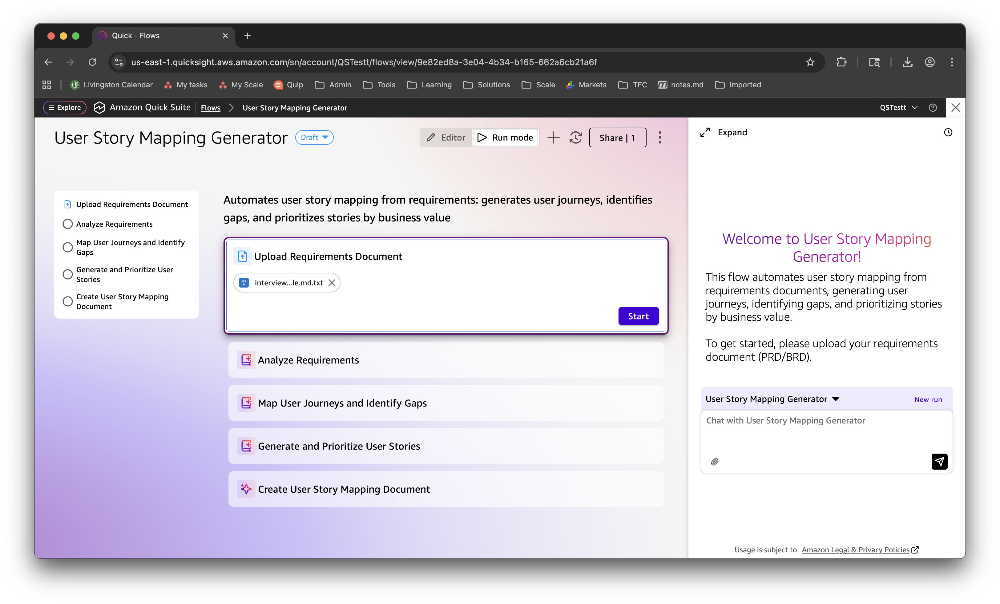
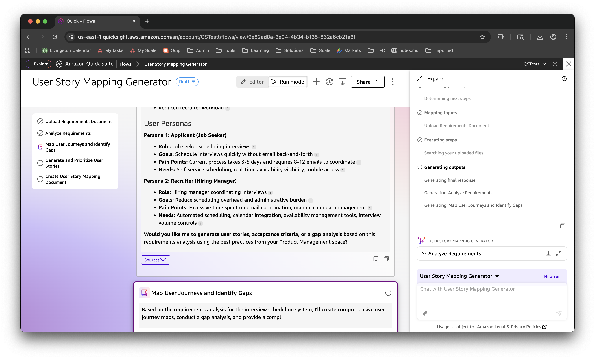
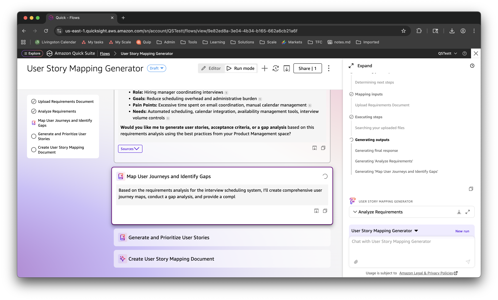
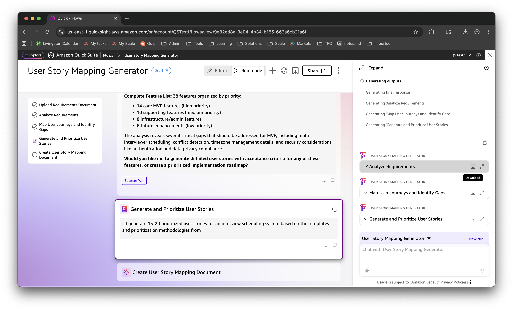
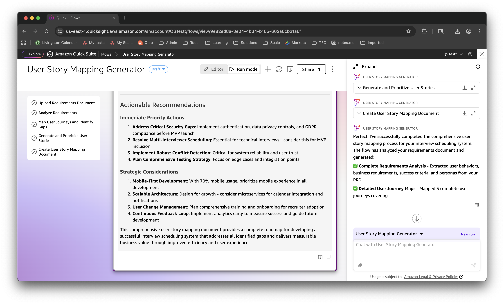

# Running the User Story Mapping Flow

This guide walks through executing the User Story Mapping Generator flow from start to finish, including how to interact with the flow at any point during execution.

## Prerequisites

- Flow created and saved (see [Creating the Flow](CREATING-THE-FLOW.md))
- Requirements document ready (PRD/BRD in PDF, DOCX, TXT, or MD format)
- Sample PRD available in `use-case-examples/interview-scheduling-prd-simple.md.txt`

---

## Step 1: Start the Flow

1. Open your flow in **Run mode**
2. The first step "Upload Requirements Document" is active
3. You'll see:
   - **Left Panel**: All 5 steps listed (only first is active)
   - **Center Panel**: File upload interface
   - **Right Panel**: Welcome message and chat interface

**Upload your document:**
- Drag and drop your PRD file into the upload area, OR
- Click **browse for files** to select from your computer
- Supported formats: PDF, DOCX, TXT, MD
- File appears with name (e.g., "interview...le.md.txt")
- Click **Start** button to begin processing

**Right Panel - Progress Tracking:**
- "Determining next steps"
- "Mapping inputs" - Upload Requirements Document
- "Executing steps" - Searching your uploaded files

---

## Step 2: Requirements Analysis in Progress

The flow automatically proceeds to analyze your requirements:

**Left Panel - Step Progress:**
- ✅ Upload Requirements Document (completed)
- ✅ Analyze Requirements (completed)
- 🔄 Map User Journeys and Identify Gaps (in progress)

**Center Panel - Analysis Output:**
Shows the completed requirements analysis with:

**User Personas Identified:**
- **Persona 1: Applicant (Job Seeker)**
  - Role: Job seeker scheduling interviews
  - Goals: Schedule interviews quickly without email back-and-forth
  - Pain Points: Current process takes 3-5 days and requires 8-12 emails to coordinate
  - Needs: Self-service scheduling, real-time availability visibility, mobile access

- **Persona 2: Recruiter (Hiring Manager)**
  - Role: Hiring manager coordinating interviews
  - Goals: Reduce scheduling overhead and administrative burden
  - Pain Points: Excessive time spent on email coordination, manual calendar management
  - Needs: Automated scheduling, calendar integration, availability management tools, interview volume controls

**Interactive Question:**
"Would you like me to generate user stories, acceptance criteria, or a gap analysis based on this requirements analysis using the best practices from your Product Management space?"

**Right Panel - Execution Status:**
- "Generating outputs"
- "Generating final response"
- "Generating 'Analyze Requirements'"
- "Generating 'Map User Journeys and Identify Gaps'"

**Key Feature - Download Outputs:**
Notice the **Download** button appears next to completed steps, allowing you to save intermediate results at any time.

---

## Step 3: Journey Mapping and Gap Analysis

The flow continues to the next step automatically:

**Left Panel - Step Progress:**
- ✅ Upload Requirements Document
- ✅ Analyze Requirements
- 🔄 Map User Journeys and Identify Gaps (in progress)
- ⭕ Generate and Prioritize User Stories (pending)
- ⭕ Create User Story Mapping Document (pending)

**Center Panel - Gap Analysis Output:**
Shows partial output from journey mapping:

**Interactive Question:**
"Would you like me to generate user stories, acceptance criteria, or a gap analysis based on this requirements analysis using the best practices from your Product Management space?"

**Below - Journey Mapping Step:**
"Based on the requirements analysis for the interview scheduling system, I'll create comprehensive user journey maps, conduct a gap analysis, and provide a compl[ete]..."

**Right Panel - Real-time Progress:**
- Shows which outputs are being generated
- Lists each step as it completes
- Provides transparency into the AI's work

**User Interaction Options:**
At any point during execution, you can:
1. **View Sources**: Click "Sources" to see what data the AI is using
2. **Copy Output**: Use copy icon to save intermediate results
3. **Download**: Save completed step outputs
4. **Chat**: Ask questions in the chat panel
5. **Expand**: Click expand icon to see full output

---

## Step 4: Story Generation and Prioritization

The flow proceeds to generate prioritized user stories:

**Left Panel - Step Progress:**
- ✅ Upload Requirements Document
- ✅ Analyze Requirements
- ✅ Map User Journeys and Identify Gaps
- 🔄 Generate and Prioritize User Stories (in progress)
- ⭕ Create User Story Mapping Document (pending)

**Center Panel - Feature List and Gap Analysis:**

**Complete Feature List:**
- 38 features organized by priority:
  - 14 core MVP features (high priority)
  - 10 supporting features (medium priority)
  - 8 infrastructure/admin features
  - 6 future enhancements (low priority)

**Gap Analysis:**
"The analysis reveals several critical gaps that should be addressed for MVP, including multi-interviewer scheduling, conflict detection, timezone management details, and security considerations like authentication and data privacy controls."

**Interactive Question:**
"Would you like me to generate detailed user stories with acceptance criteria for any of these features, or create a prioritized implementation roadmap?"

**Below - Story Generation Step:**
"I'll generate 15-20 prioritized user stories for an interview scheduling system based on the templates and prioritization methodologies from..."

**Right Panel - Download Available:**
- **Download** button appears for completed steps
- Click to save "Analyze Requirements" output
- Click to save "Map User Journeys and Identify Gaps" output
- Click to save "Generate and Prioritize User Stories" output

**Key Feature - Incremental Downloads:**
You don't have to wait for the entire flow to complete. Download intermediate results as each step finishes.

---

## Step 5: Flow Completion and Final Document

All steps complete successfully:

**Left Panel - All Steps Completed:**
- ✅ Upload Requirements Document
- ✅ Analyze Requirements
- ✅ Map User Journeys and Identify Gaps
- ✅ Generate and Prioritize User Stories
- ✅ Create User Story Mapping Document

**Center Panel - Final Output:**

**Actionable Recommendations:**

**Immediate Priority Actions:**
1. **Address Critical Security Gaps**: Implement authentication, data privacy controls, and GDPR compliance before MVP launch
2. **Resolve Multi-Interviewer Scheduling**: Essential for technical interviews - consider this for MVP inclusion
3. **Implement Robust Conflict Detection**: Critical for system reliability and user trust
4. **Plan Comprehensive Testing Strategy**: Focus on edge cases and integration points

**Strategic Considerations:**
1. **Mobile-First Development**: With 70% mobile usage, prioritize mobile experience in all development
2. **Scalable Architecture**: Design for growth - consider microservices for calendar integration and notifications
3. **User Change Management**: Plan comprehensive training and onboarding for recruiter adoption
4. **Continuous Feedback Loop**: Implement analytics early to measure success and guide future development

**Summary:**
"This comprehensive user story mapping document provides a complete roadmap for developing a successful interview scheduling system that addresses all identified gaps and delivers measurable business value through improved efficiency and user experience."

**Right Panel - Success Summary:**
"Perfect! I've successfully completed the comprehensive user story mapping process for your interview scheduling system. The flow has analyzed your requirements document and generated:"

✅ **Complete Requirements Analysis** - Extracted user behaviors, business requirements, success criteria, and personas from your PRD

✅ **Detailed User Journey Maps** - Mapped 5 complete user journeys covering...

**Download All Outputs:**
- Click **Download** next to any completed step
- Each step's output is saved as a separate document
- Final document includes everything in one comprehensive report

---

## Interacting with the Flow

### During Execution

**Ask Questions:**
- Use the chat panel on the right at any time
- Example: "Can you explain the gap analysis?"
- Example: "What are the P0 stories?"
- The AI will respond based on the current context

**View Sources:**
- Click "Sources" button on any output
- See what knowledge space content was used
- Verify the AI's reasoning

**Copy/Download Outputs:**
- Copy icon: Copy text to clipboard
- Download button: Save as document
- Available for each completed step

**Expand Outputs:**
- Click expand icon to see full output in larger view
- Useful for long outputs like user stories

### After Completion

**Start New Run:**
- Click "New run" button in the right panel
- Upload a different requirements document
- The flow resets and starts from Step 1

**Review and Refine:**
- Download all outputs
- Review the generated user story map
- If adjustments needed, you can:
  - Edit the flow prompts (switch to Editor mode)
  - Re-run with modified requirements document
  - Use the chat to ask for specific changes

**Share Results:**
- Share downloaded documents with stakeholders
- Share the flow with team members for their use
- Export to your project management tools

---

## Expected Outputs

After completion, you'll have:

1. **Requirements Analysis Document**
   - User behaviors extracted
   - Business requirements identified
   - Success criteria defined
   - User personas created

2. **User Journey Maps**
   - Complete journey flows
   - Touchpoints identified
   - Pain points highlighted
   - Gap analysis included

3. **Prioritized User Stories**
   - 15-20 user stories
   - Acceptance criteria (Given-When-Then format)
   - Priority levels (P0/P1/P2)
   - Business value assessment

4. **Comprehensive User Story Mapping Document**
   - Executive summary
   - All journey maps
   - Complete gap analysis
   - All prioritized stories
   - Traceability matrix
   - Actionable recommendations
   - Next steps

---

## Tips for Best Results

**Requirements Document Quality:**
- Include clear problem statements
- Specify user types and personas
- List key features and capabilities
- Define success metrics
- Mention technical constraints

**Knowledge Space Content:**
- Add your organization's story templates
- Include product-specific terminology
- Upload UI mockups or design systems
- Add prioritization frameworks

**Flow Customization:**
- Adjust prompts in Editor mode for your needs
- Modify story format (e.g., Job Stories vs User Stories)
- Change prioritization criteria
- Add custom validation rules

**Iterative Refinement:**
- Run the flow multiple times with refined inputs
- Use chat to ask for specific adjustments
- Download and compare different runs
- Incorporate feedback from stakeholders

---

## Troubleshooting

**Issue**: Flow stops or times out during execution
- **Solution**: Click "New run" and try again. If it persists, the requirements document may be too large or complex. Try breaking it into smaller sections.

**Issue**: Generated stories don't match expectations
- **Solution**: 
  1. Add more context to your knowledge space
  2. Modify the flow prompts in Editor mode
  3. Provide more detailed requirements document
  4. Use the chat to request specific changes

**Issue**: Can't download outputs
- **Solution**: Ensure the step has completed (checkmark appears). If the download button is missing, try refreshing the page.

**Issue**: Want to modify a completed step's output
- **Solution**: You can't edit outputs directly, but you can:
  1. Start a new run with modified inputs
  2. Use the chat to ask for regeneration
  3. Manually edit the downloaded document

---

## Next Steps

After completing your first run:

1. **Review Outputs**: Download and review all generated documents
2. **Share with Team**: Distribute to product managers, developers, and stakeholders
3. **Refine and Iterate**: Run again with feedback incorporated
4. **Integrate into Workflow**: Use regularly for new features and enhancements
5. **Customize Flow**: Adjust prompts and steps to match your organization's needs

For more information, see the main [README.md](README.md) for deployment instructions and customization options.
