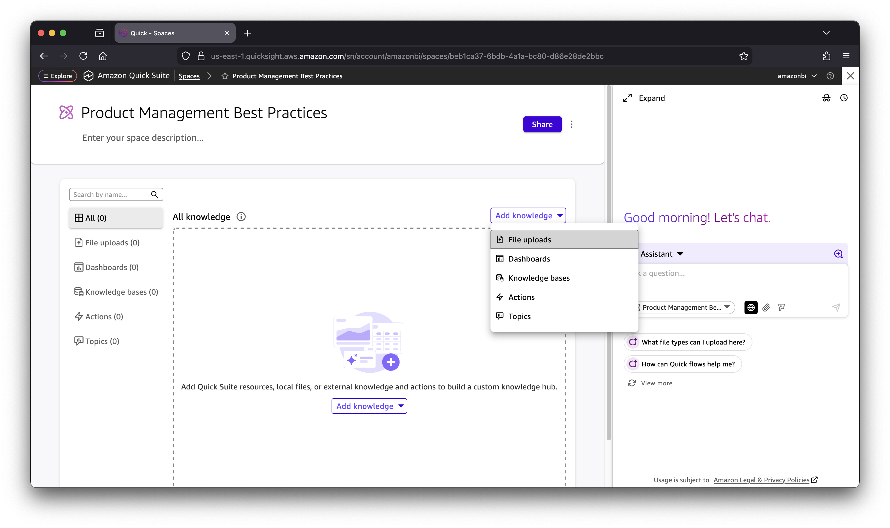
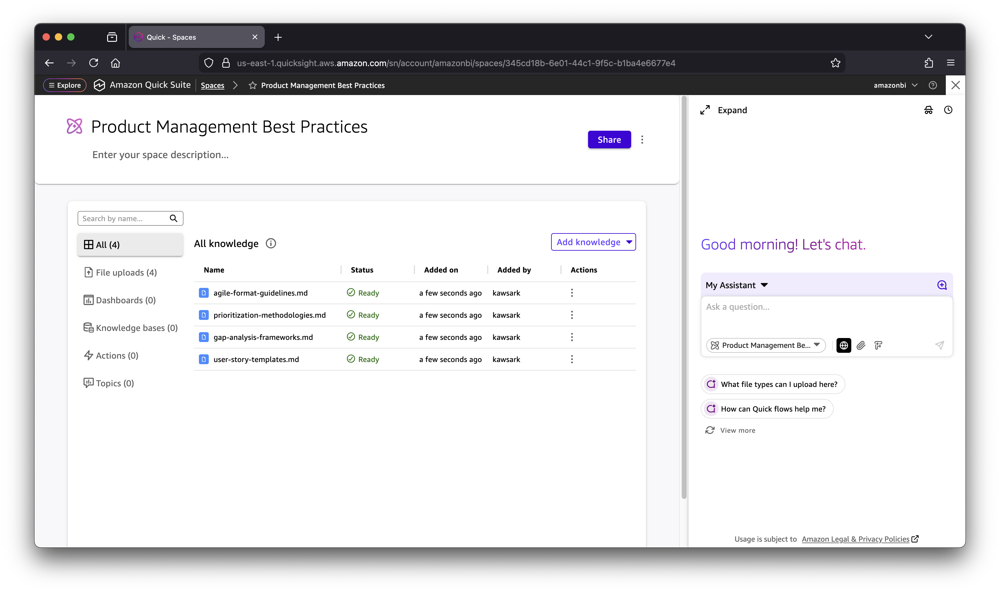

# Creating the Quick Suite Space

This guide walks you through creating a Quick Suite space for "Product Management Best Practices" that will be used by the User Story Mapping Generator flow.

## What is a Quick Suite Space?

A Quick Suite space is a centralized knowledge hub where you can organize and manage content that AI assistants use to provide contextually relevant responses. Spaces allow you to:

- **Customize AI behavior**: Upload company-specific information, templates, and guidelines
- **Centralize knowledge**: Store product details, brand guidelines, terminology, and reference materials
- **Improve output quality**: AI generates stories that match your organization's standards
- **Enable reusability**: Share knowledge across multiple flows and team members

For more information, see [Working with Spaces](https://docs.aws.amazon.com/quicksuite/latest/userguide/working-with-spaces.html) in the AWS documentation.

## Prerequisites

- AWS account with Amazon Quick Suite access
- Amazon Quick Suite subscription (per-user pricing)
- Permissions to create spaces

## Step 1: Create the Space

1. Navigate to **Amazon Quick Suite** in the AWS Console
2. Click on **Spaces** in the left navigation menu
3. Click **Create space**
4. Enter the space name: `Product Management Best Practices`
5. (Optional) Add a description for the space
6. Click **Create**

## Step 2: Add Knowledge Content

Once your space is created, you can add knowledge content to customize the AI's behavior:

1. Click **Add knowledge** dropdown in your space
2. Select **File uploads** to upload documents
3. Upload the sample files from the `knowledge-space-content/` directory:
   - `user-story-templates.md` - Story format templates
   - `agile-format-guidelines.md` - Agile formatting standards
   - `gap-analysis-frameworks.md` - Gap analysis methodologies
   - `prioritization-methodologies.md` - Prioritization approaches

## Customization Options

You can customize the space with your organization's specific content:

### Product Information
- Product roadmaps and strategy documents
- Feature specifications and technical requirements
- UI/UX design systems and mockups
- API documentation and integration guides

### Templates and Standards
- User story templates (Given-When-Then format)
- Acceptance criteria guidelines
- Definition of Done checklists
- Story point estimation guides

### Company Guidelines
- Brand voice and terminology
- Compliance and security requirements
- Accessibility standards
- Localization guidelines

### Reference Materials
- Competitive analysis documents
- Customer research and personas
- Market analysis reports
- Industry best practices

## Next Steps

After creating and populating your space:

1. The space will be automatically available when creating flows
2. Reference this space in your flow configuration
3. The AI will use this knowledge to generate contextually relevant user stories
4. Update the space content as your standards evolve

## Tips

- **Start simple**: Begin with basic templates and add more content over time
- **Keep it current**: Regularly update content to reflect current standards
- **Share with team**: Use the Share button to give team members access
- **Organize content**: Use clear file names and structure for easy maintenance

---

**Next**: [Creating the Flow](creating-the-flow.md)
